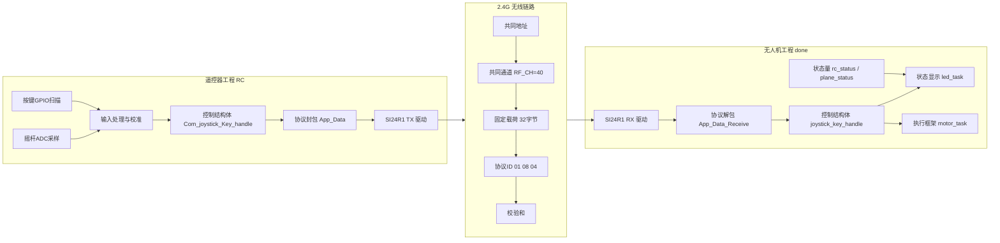
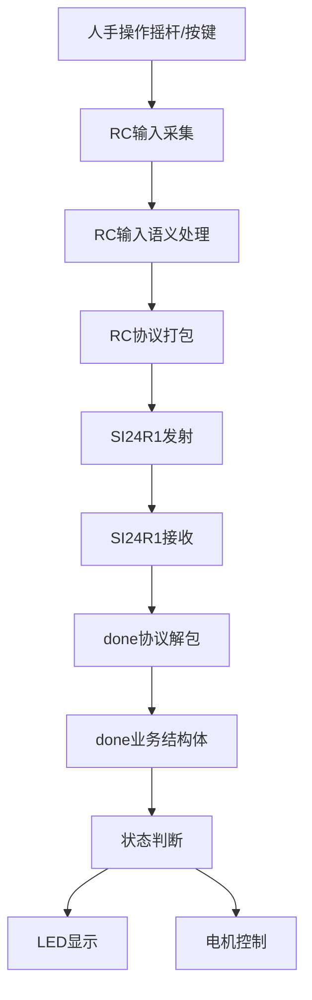
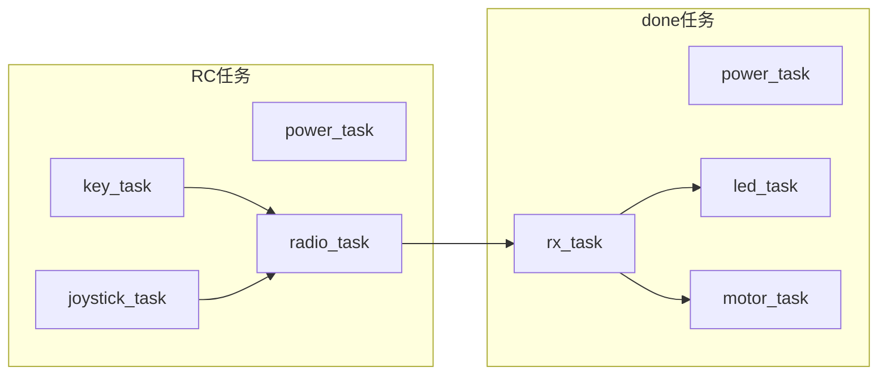
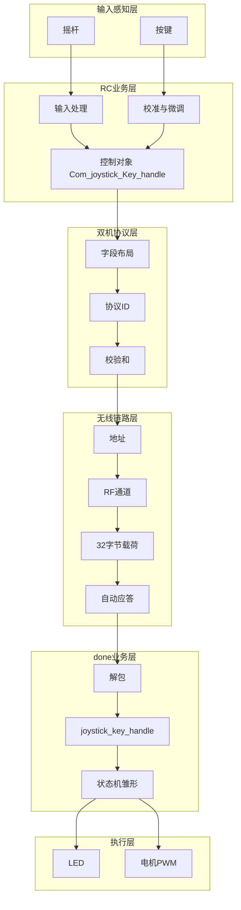
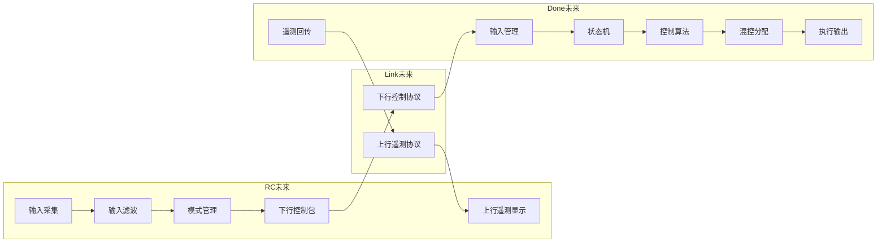

# 遥控器与无人机双机联合架构图

这份文档把 `RC` 遥控器工程和 `done` 无人机工程放到同一张系统图里，帮助你从“单工程视角”提升到“整机系统视角”。

---

## 1. 双机系统一句话定义

这套系统可以定义为：

“一个由遥控器输入端、2.4G 无线控制链路和无人机执行端组成的双 MCU 控制系统。”

其中：

- `RC` 是命令源
- `done` 是命令接收与执行端
- `SI24R1` 无线链路是两者之间的桥梁

---

## 2. 双机联合总架构图

---

## 3. 从架构师视角看，这个系统分成哪几块

### 3.1 输入系统

属于 RC 工程。

输入源包括：

- 4 路摇杆 ADC
- 多个功能按键

它的职责不是“直接发数”，而是“把人的操作变成稳定的控制语义”。

### 3.2 协议系统

横跨 RC 和 done 两个工程。

它的职责是：

- 把控制语义转成固定格式数据包
- 保证双方能按同样方式理解这个包

这是双机系统里最应该文档化的一层。

### 3.3 无线链路系统

横跨 RC 和 done 两个工程。

它的职责是：

- 提供物理与链路层传输能力
- 管理地址、管道、通道、应答、FIFO

它不应该关心 `pitch` 是俯仰还是横滚，这属于应用协议层。

### 3.4 执行系统

属于 done 工程。

它的职责是：

- 接收控制帧
- 还原控制命令
- 驱动状态显示和执行器

未来真正的飞控闭环，也会长在这一侧。

---

## 4. 双机数据流图

这张图最重要的意义是告诉你：

- 人的操作不是直接到电机
- 中间要经过采集、语义转换、协议封装、无线链路、解包、状态处理

一旦中间任意一层出问题，系统表现都会异常。

---

## 5. 双机任务级关系图

这说明当前系统的关键任务交互主链路是：

`RC key_task / joystick_task -> RC radio_task -> done rx_task -> done led_task / motor_task`

---

## 6. 双机联合分层图

---

## 7. 现阶段系统成熟度判断

如果用架构成熟度来评价，现在这套双机系统大概处于：

“控制链路已打通，执行框架已搭好，闭环控制尚未完全形成”

具体拆开看：

### 7.1 已经比较清楚的部分

- 双机角色分工清楚
- 无线链路基本打通
- 协议字段已有雏形
- 任务框架已分开
- 电机/LED 基础驱动已接入

### 7.2 还在成长中的部分

- done 端控制中心还没形成
- 状态机还没有统一收口
- 控制位语义还不够严格
- 双向通信还没有正式成型
- 调度周期还偏调试风格

---

## 8. 作为维护者，你以后应该怎么从系统图切入

建议永远按下面这个顺序排查。

### 8.1 如果“摇杆动了但无人机没反应”

先查：

1. RC 端 ADC 是否在更新
2. RC 端 `Com_joystick_Key_handle` 是否变化
3. `app_data_send()` 是否正常打包
4. 无线发包是否成功
5. done 端 `SI24R1_RxPacket()` 是否收到数据
6. `App_Data_Receive()` 是否通过校验
7. `joystick_key_handle` 是否被更新

### 8.2 如果“包收到了但状态不对”

先查：

1. 字段顺序是否一致
2. 数值是否已被 RC 端缩放/偏移
3. `shutdown` / `hold_height` 是否存在持续置位问题
4. done 端状态量是否真正使用了解包结果

### 8.3 如果“灯会变但电机没反应”

说明问题更可能在 done 端执行层：

1. `rx_task` 可能已经正常
2. `led_task` 可能已经读到了状态
3. 但 `motor_task` 当前还没有完整接入控制输出闭环

---

## 9. 面向后续演进的理想双机架构图

下面这张图不是现状，而是更成熟的目标形态。

这张图表达了未来最值得补齐的 4 个中心：

- 输入中心
- 状态中心
- 控制中心
- 遥测中心

---

## 10. 给你的一点架构思维建议

你现在已经不只是维护两个独立工程了，而是在维护一个“双节点系统”。

所以以后想问题时，建议多问下面这些问题：

1. 这个变更属于 RC 端、done 端，还是协议层？
2. 改的是输入语义、字段布局，还是无线参数？
3. 这个状态由哪一端产生，哪一端消费？
4. 如果交给下一个人，他能不能只看图就先理解 70%？

当你开始这样看项目时，你的思维就已经越来越接近架构师了。

---

## 11. 一句话结论

当前这套系统最适合用下面这句话来概括：

“RC 工程负责把人的操作变成标准化控制帧，done 工程负责把控制帧还原为执行命令并驱动本机行为，双机系统的核心边界在协议层和无线链路层。”
