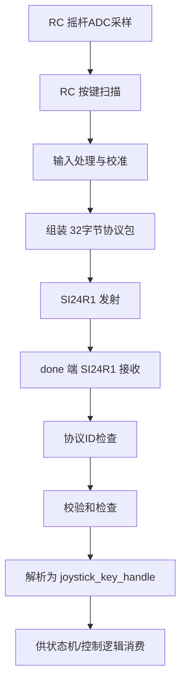
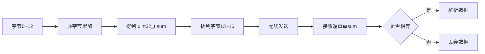

# 遥控器项目与无人机项目双机通信协议文档

## 1. 文档目的

这份文档用于说明 `RC` 遥控器工程和 `done` 无人机执行端工程之间的通信约定。

它主要解决 4 个问题：

1. 遥控器到底发了什么
2. 无人机到底怎么收和怎么解
3. 两边哪些参数必须完全一致
4. 后续改协议时应该先改哪里、再改哪里

---

## 2. 双机角色定义

当前两个工程的角色可以这样定义：

### 2.1 遥控器工程 `RC`

职责：

- 采集摇杆输入
- 采集按键输入
- 对原始输入做方向修正、缩放、校准、微调
- 组装成固定长度无线数据包
- 通过 `SI24R1` 发送给无人机

主要入口：

- `../RC/Core/Src/main.c`
- `../RC/rc_task/rc_task.c`
- `../RC/App/Src/App_Data.c`

### 2.2 无人机工程 `done`

职责：

- 初始化 `SI24R1` 接收模式
- 接收遥控器发来的固定长度数据包
- 校验协议标识与校验和
- 将字节流还原为业务结构体
- 供后续状态机、控制逻辑、电机控制使用

主要入口：

- `Core/Src/main.c`
- `done_task/done_task.c`
- `App/Src/App_Data.c`

---

## 3. 当前通信链路总览

当前双机链路是单向控制链路：

`RC 遥控器 -> SI24R1 无线发送 -> done 无人机接收`

从代码现状看：

- 遥控器端负责发控制包
- 无人机端负责收控制包
- 当前没有看到正式启用的“无人机回传遥控器”业务链路
- 无线芯片层启用了自动应答，但业务层没有定义上行遥测协议

所以这份协议文档主要描述“下行控制协议”。

---

## 4. 双机通信主流程



---

## 5. 双机必须一致的无线链路参数

这部分是两边最不能改乱的地方。

### 5.1 地址

RC 端和 done 端都使用相同的 `TX_ADDRESS`：

- `0x0A, 0x01, 0x07, 0x0E, 0x01`

代码位置：

- `../RC/Internet/Src/Int_SI4R1.c:2`
- `Internet/Src/Int_SI4R1.c:2`

### 5.2 射频通道

两边都配置：

- `RF_CH = 40`

代码位置：

- `../RC/Internet/Src/Int_SI4R1.c:49`
- `../RC/Internet/Src/Int_SI4R1.c:157`
- `Internet/Src/Int_SI4R1.c:49`
- `Internet/Src/Int_SI4R1.c:157`

### 5.3 载荷长度

两边都使用：

- `TX_PLOAD_WIDTH = 32`

也就是固定 32 字节包。

### 5.4 芯片工作模式

RC 端：

- 初始化为 `TX Mode`

done 端：

- 初始化为 `RX Mode`

### 5.5 自动应答与接收管道

从当前配置看，两边都开启了：

- `EN_AA = 0x01`
- `EN_RXADDR = 0x01`

也就是使用 `pipe0` 做基础链路确认。

---

## 6. 当前应用层协议格式

当前有效载荷是 32 字节，其中前 17 字节已经定义明确，后面的字节暂时未正式使用。

### 6.1 字节布局表

| 字节下标 | 长度 | 字段名 | 类型 | 含义 |
| --- | --- | --- | --- | --- |
| `0~1` | 2 | `pitch` | `int16_t` | 俯仰控制量 |
| `2~3` | 2 | `roll` | `int16_t` | 横滚控制量 |
| `4~5` | 2 | `yaw` | `int16_t` | 偏航控制量 |
| `6~7` | 2 | `throttle` | `int16_t` | 油门控制量 |
| `8` | 1 | `shutdown` | `uint8_t`语义 | 关机/停机功能位 |
| `9` | 1 | `hold_height` | `uint8_t`语义 | 定高功能位 |
| `10` | 1 | `PROTOCOL_ID1` | `uint8_t` | 协议标识 1 |
| `11` | 1 | `PROTOCOL_ID2` | `uint8_t` | 协议标识 2 |
| `12` | 1 | `PROTOCOL_ID3` | `uint8_t` | 协议标识 3 |
| `13~16` | 4 | `checksum` | `uint32_t` | 前 13 字节求和结果 |
| `17~31` | 15 | 保留区 | 未定义 | 当前未正式使用 |

### 6.2 协议标识

当前 3 个协议标识字节固定为：

- `0x01`
- `0x08`
- `0x04`

代码位置：

- `../RC/App/Inc/App_Data.h:9`
- `../RC/App/Inc/App_Data.h:10`
- `../RC/App/Inc/App_Data.h:11`
- `App/Inc/App_Data.h:7`
- `App/Inc/App_Data.h:8`
- `App/Inc/App_Data.h:9`

---

## 7. 字段编码方式

### 7.1 四个摇杆量

RC 端发送时使用高字节在前、低字节在后：

```text
txbuffer[0] = pitch >> 8
txbuffer[1] = pitch & 0xff
```

无人机端按同样方式还原：

```text
pitch = (rx[0] << 8) | rx[1]
```

所以当前协议的 16 位字段编码方式是：

- 大端拆分
- 高字节在前，低字节在后

对应字段：

- `pitch`
- `roll`
- `yaw`
- `throttle`

### 7.2 功能位字段

`shutdown` 和 `hold_height` 当前占 1 字节，但业务语义更像布尔/状态位。

当前代码里常见写法是：

- `shutdown = 1`
- `hold_height = 1`

所以当前理解应为：

- `0` 表示未触发
- `1` 表示触发

注意：

- 当前 RC 端代码里没有看到明确“自动清零”的统一机制
- 这意味着维护时要特别确认这些位是“脉冲型事件”还是“持续型状态”

---

## 8. 校验规则

当前协议使用的是“前 13 字节无符号求和校验”。

### 8.1 发送端规则

RC 端在 `app_data_send()` 中：

1. 先填充 `0~12` 字节
2. 对 `0~12` 共 13 字节逐字节求和
3. 将结果写入 `13~16` 字节

代码位置：

- `../RC/App/Src/App_Data.c:139`
- `../RC/App/Src/App_Data.c:156`

### 8.2 接收端规则

done 端在 `App_Data_Receive()` 中：

1. 先检查 `10~12` 字节的协议标识
2. 对 `0~12` 共 13 字节重新求和
3. 与 `13~16` 拼成的 32 位值做比较
4. 一致则认为数据有效

代码位置：

- `App/Src/App_Data.c:4`
- `App/Src/App_Data.c:11`
- `App/Src/App_Data.c:15`

### 8.3 校验图



---

## 9. RC 端数据生成过程

这个过程很关键，因为协议字段不是直接拿 ADC 原始值发出去，而是经过了业务处理。

### 9.1 摇杆数据来源

RC 端 `Int_Joystick` 使用：

- `ADC + DMA` 循环采样 4 路数据

通道语义：

- `adc_data[0] -> throttle`
- `adc_data[1] -> pitch`
- `adc_data[2] -> roll`
- `adc_data[3] -> yaw`

代码位置：

- `../RC/Internet/Src/Int_Joystick.c:5`
- `../RC/Internet/Src/Int_Joystick.c:27`

### 9.2 数据预处理流程

在 `../RC/App/Src/App_Data.c:28` 的 `app_data_Read_handle_data()` 中，当前顺序是：

1. 读取 ADC 原始值
2. 做方向反向处理：`4095 - value`
3. 将 `0~4095` 映射到 `0~1000`
4. 减去校准偏移量
5. 限幅到 `0~1000`
6. 加上微调量

也就是说，无人机端收到的不是 ADC 原始量，而是“已经映射成控制语义尺度”的值。

### 9.3 按键数据来源

按键由 `key_task` 周期调用 `app_data_offset()` 处理。

当前按键语义包括：

- `KEY_RIGHT_X_LONG`：执行摇杆零点/中位校准
- `KEY_UP / KEY_DOWN`：调整 `pitch_adjust`
- `KEY_LEFT / KEY_RIGHT`：调整 `roll_adjust`
- `KEY_LEFT_X`：设置 `shutdown = 1`
- `KEY_RIGHT_X`：设置 `hold_height = 1`

代码位置：

- `../RC/rc_task/rc_task.c:83`
- `../RC/App/Src/App_Data.c:72`

---

## 10. done 端解包过程

### 10.1 接收入口

无人机端 `rx_task` 周期调用：

- `App_Data_Receive(&joystick_key_handle)`

代码位置：

- `done_task/done_task.c:161`
- `done_task/done_task.c:165`

### 10.2 解包顺序

`App_Data_Receive()` 当前顺序是：

1. 调 `SI24R1_RxPacket()` 取 32 字节数据
2. 检查协议 ID
3. 校验求和
4. 将前 10 字节解析成业务字段
5. 写入全局 `joystick_key_handle`
6. 打印日志

代码位置：

- `App/Src/App_Data.c:4`

### 10.3 解包结果对象

解包后写入的数据结构是：

- `joystick_key_handle`

定义位置：

- `Common/Inc/Common_types.h`
- `Common/Src/Common_types.c`

这说明当前双机协议在业务层上的核心共享模型就是：

- `Com_joystick_Key_handle_t`

RC 端负责填充它的协议映射
done 端负责从协议映射还原它

---

## 11. 当前双机链路的节拍关系

这部分非常值得单独写清楚。

### 11.1 RC 端

当前任务周期：

- `key_task`: `10ms`
- `joystick_task`: `1000ms`
- `radio_task`: `1000ms`

代码位置：

- `../RC/rc_task/rc_task.c:132`
- `../RC/rc_task/rc_task.c:149`

### 11.2 done 端

当前接收任务周期：

- `rx_task`: `500ms`

代码位置：

- `done_task/done_task.c:167`

### 11.3 这意味着什么

当前链路更像是：

- 原型验证节拍
- 调试节拍

而不是：

- 实时飞控节拍

因为：

- 发送频率约 1Hz
- 接收频率约 2Hz

对于真正的飞行控制，这个更新频率通常会偏低很多。

所以后续如果项目进入真机飞控阶段，协议本身可以不变，但任务周期和状态处理策略大概率要重新设计。

---

## 12. 双机协议的边界划分

从架构角度，建议把这个双机系统拆成 4 层边界来理解。

### 12.1 输入语义层

只属于 RC 端。

负责：

- ADC 采样
- 按键识别
- 校准与微调

### 12.2 应用协议层

横跨 RC 和 done 两端。

负责：

- 字段布局
- 字节顺序
- 校验规则
- 协议标识

### 12.3 无线链路层

横跨 RC 和 done 两端。

负责：

- 地址
- 载荷长度
- 通道
- TX/RX 模式
- 自动应答

### 12.4 控制执行层

只属于 done 端。

负责：

- 将协议数据转为系统状态
- 驱动 LED / 电机 / 保护逻辑

这 4 层拆开以后，你以后改系统时就不容易把“输入处理”“协议变更”“无线参数变更”“控制逻辑变更”混到一起。

---

## 13. 当前协议里的隐含约定

这部分是交接时最容易漏掉，但实际最重要的内容。

### 13.1 `pitch/roll/yaw/throttle` 的数值范围不是原始 ADC

它们是：

- 经过方向修正
- 经过 0~1000 映射
- 经过 offset 校准
- 经过微调量叠加

之后才发送的。

### 13.2 `shutdown` 和 `hold_height` 的业务语义还需要继续收敛

当前看起来更像“功能触发位”，但是否需要自动清零，代码里还没有形成严格闭环。

### 13.3 后 15 字节目前保留

这是一块很好的扩展区，未来可以放：

- 模式位
- 电池状态
- 校准完成标志
- 协议版本号
- 备用开关量

### 13.4 协议版本目前没有单独字段

现在靠 `PROTOCOL_ID1~3` 区分“这个包是不是本项目协议”，但还不能很好地区分协议版本。

所以未来如果要扩协议，建议增加：

- `version`
- `msg_type`

---

## 14. 当前双机链路的风险点

### 14.1 RC 端 `SI_EN` GPIO 配置和代码语义疑似不一致

在 RC 工程中：

- 代码把 `SI_EN` 当作 CE 输出脚使用
- 但 `gpio.c` 里它被配置成了 `GPIO_MODE_IT_RISING`

这对维护者是一个高风险点，建议后续优先核对硬件原理图和 CubeMX 配置。

代码位置：

- `../RC/Core/Src/gpio.c:76`
- `../RC/Internet/Inc/Int_SI4R1.h`

### 14.2 按键引脚命名和句柄映射存在交叉风险

RC 项目里 `main.h` 中的部分按键命名和 `Int_Key.c` 中的句柄映射存在交叉理解风险，后续查键值异常时要同时对照原理图和代码。

### 14.3 控制位清零机制尚不清晰

当前没看到统一的“触发一次后清零”流程，后续如果业务异常，先查这类状态位的生命周期。

### 14.4 双机调度周期不匹配飞控实时性

当前更适合原型验证，不适合高实时闭环控制。

---

## 15. 后续扩协议建议

如果你后面继续升级系统，建议按下面顺序演进，而不是直接随手往 buffer 里塞字段。

### 15.1 先补版本字段

建议在保留区里增加：

- `version`
- `msg_type`

### 15.2 再补状态字段

比如：

- 遥控器工作模式
- 校准完成标志
- 急停标志

### 15.3 最后再考虑双向协议

如果将来要让无人机回传给遥控器，建议明确拆成：

- 下行控制包
- 上行遥测包

不要把双向业务混在同一包语义里。

---

## 16. 一句话结论

当前这套双机协议，本质上是：

“RC 端把摇杆与按键输入整理成一个固定 32 字节的控制帧，通过 SI24R1 单向下发给 done 无人机端；done 端再按相同字段布局与校验规则还原为业务结构体 `joystick_key_handle`。”

只要后续你始终围绕这 4 个核心点去维护：

- 无线参数一致
- 字段布局一致
- 校验规则一致
- 状态语义一致

这套双机链路就会比较稳。
