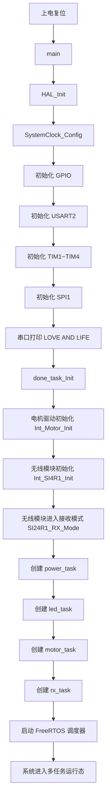
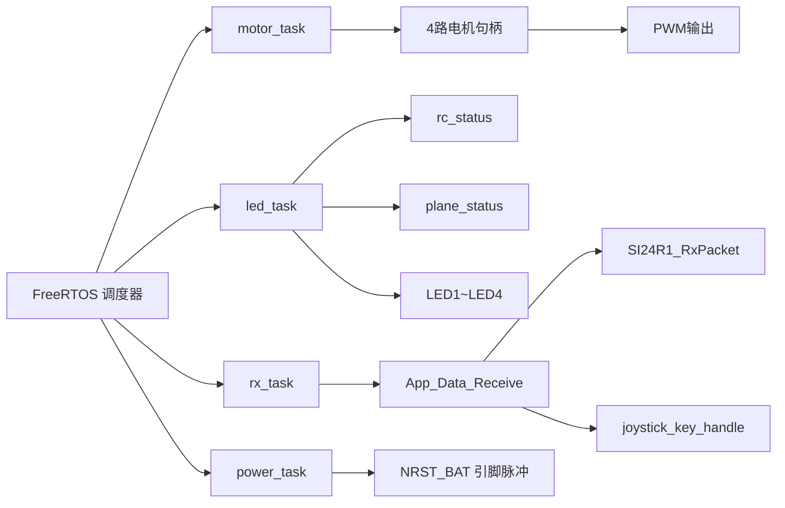
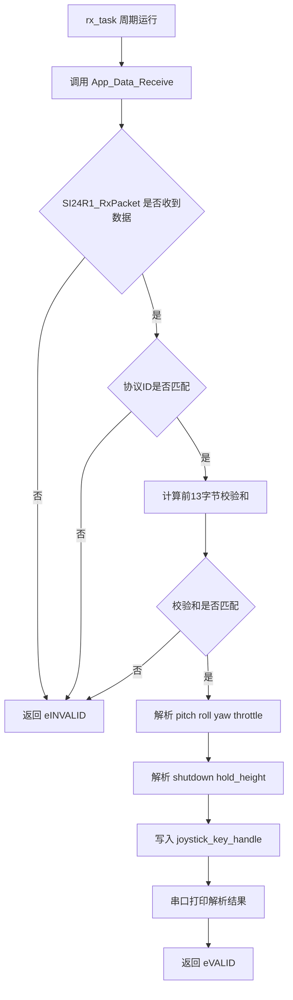
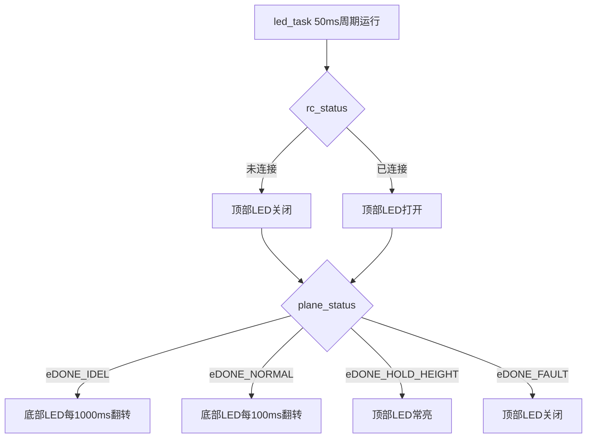
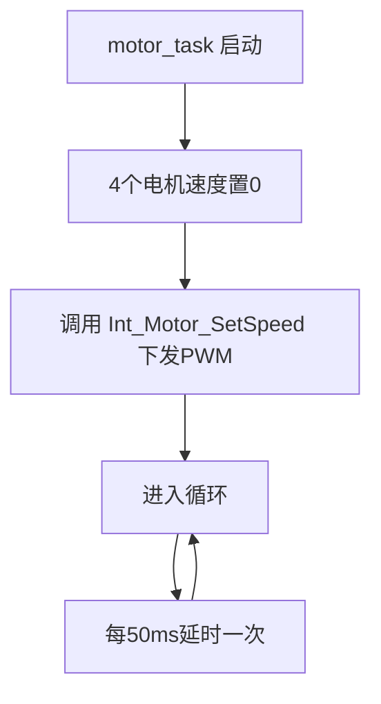
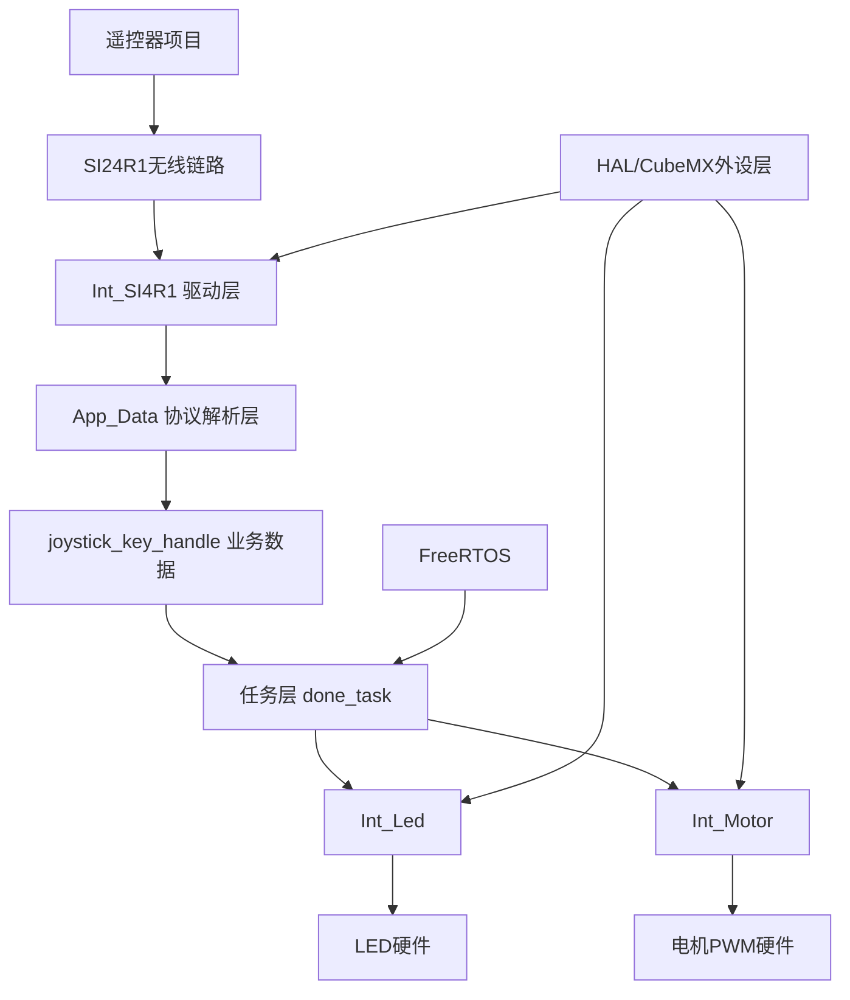
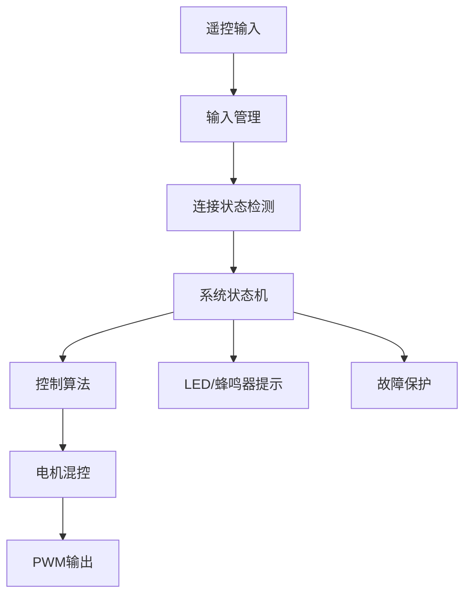

# 无人机项目流程图

这份文档用流程图把当前工程的主流程、运行流程和数据流画出来，方便后续维护时快速进入上下文。

---

## 1. 系统启动流程图

---

## 2. 任务运行关系图

---

## 3. 遥控数据接收流程图

---

## 4. LED 状态逻辑图

---

## 5. 电机输出当前流程图

说明：

- 当前流程里还没有“根据遥控输入更新电机速度”的逻辑
- 所以这部分目前只是一个执行框架，不是完整控制闭环

---

## 6. 当前架构关系图

---

## 7. 后续建议新增的理想流程图

下面这张不是当前已实现，而是推荐你未来演进时参考的理想链路。

它表达的是一个更“架构化”的思路：

- 输入和状态分离
- 状态和执行分离
- 控制和驱动分离
- 显示/告警作为独立输出通道

---

## 8. 维护时怎么用这份流程图

建议你每次维护都按这个顺序看：

1. 先看“系统启动流程图”，确认初始化链路
2. 再看“任务运行关系图”，确认业务在哪些任务里跑
3. 再看“遥控数据接收流程图”，确认输入来源
4. 最后看“当前架构关系图”，判断新功能应该加在哪一层

这样你会越来越像在“设计系统”，而不是只在“找代码”。
